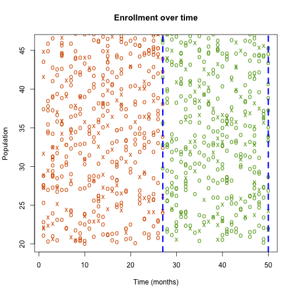
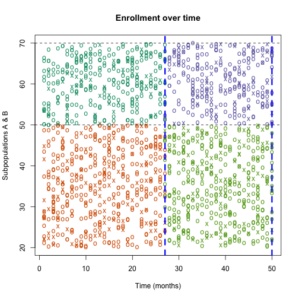

Intro to Adaptive Trials, and the EAGLE Visualization Tool
===
author: Aaron Fisher
date: 2013-10-17

A project with Harris Jaffee & Michael Rosenblum

(Journal Club Presentation)

<!--
Abstract
This talk will be an introduction to how adaptive trials work, and the basic theoretical framework behind them. We'll be glossing over the more complicated details, so if you know what a multivariate normal distribution is, and you know what a null distribution is, it should be a breeze.

The specific application we'll be talking about is a trial design where we start by enrolling everyone, and then decide who to continue enrolling based on results from the currenlty enrolled patients. For example, if one subpopulation doesn't appear to be benefiting, we might stop enrollinging them towards the end of the trial. This summer I worked on a Shiny App with Harris Jaffee and Michael Rosenblum, which helps users explore trial designs with this kind of adaptive enrollment. If there's time, I'll show some of the app's bells & whistles.

Slides are here:
https://rawgithub.com/aaronjfisher/Presentations/master/2013/2013-10-17_EAGLE_Journal_Club_Aaron_Fisher/2013-10-17_EAGLE_Journal_Club_Aaron_Fisher.html
-->

Background/Context
===

We might think a treatment is effective, but not know how best to implement it.

- How strong is the treatment effect? (How many patients will we need to enroll to detect it?)
- Is it only effective in a subpopulation?
- Is it harmful to a subpopulation?
- What dose should we give?

All of these can correspond to decisions in the trial design stage

In this presentation we'll be focusing on the question of "Who should we enroll?"

Interim Checks
===

- One approach is to conduct a series of traditional trials, each testing in a different subpopulation.
- Another approach is to start enrolling everyone, and use the data from initial patients to inform our decisions of who to keep enrolling as the trial continues.
  - Generally, we fix a number of "stages" for the trial ($K$), and do a check at the end of each stage.
  - The length, enrollment can take a long time. We will have some measurements before we've enrolled all our patients.
  

Group Sequential Designs v. Adaptive Enrollment designs
===
incremental: true

In any one trial, you could:

- Fix a subpopulation, run the whole trial.
- Fix a subpopulation, check at the end of each stage to see if you should end the trial early (for efficacy or futility).
  - Group Sequential Trial with Fixed Enrollment
- Split population into two subpopulations. At the end of each stage, check for efficacy and futility in each subpopulation.
  - Group Sequential Trial with Adaptive Enrollment

Deciding when to stop (Fixed Enrollment)
===
- Check Z-statistic for treatment effect at the end of each stage.
  - Let $Z_k$ be the test statistic using all the data up to stage $k$.
- If $Z_k$ crosses an efficacy boundary (threshold), stop the trial and declare success.
  - Analagous to the classic "1 stage" trial, where the boundary is just the value 1.96 (for α =.05).
- If $Z_k$ crosses a futility boundary, stop the trial and declare failure. These don't affect $α$.

Efficacy Boundaries (Fixed Enrollment)
===
right: 55%
  
- Efficacy boundaries can be a constant, or a function of stage number (as we show here →).

***

 

Calibrating an Efficacy Boundary
===
- People often use efficacy bondaries of the form $cB(k)$, where $c$ is a "proportionality" constant, and $B(k)$ is a funtion of $k$.
  - $B(k)$= constant flat line, or a nice curve shape (last slide). $B(k)$ essentially specifies a member of a class of boundary shapes that are unique up to scaling.
  - For just one stage, could use $B(k)=1$, and $c=1.96$.
  - For multiple stages $c$ is calibrated such that the *familywise* type I error rate = $α$ 
  
  
$$
P_{null}(Z_k>\text{cB(k),   for any } k≤K ) <α 
$$

Calibrating Efficacy Boundary
===
- To get the most efficient cutoffs for $Z_k$, we'd like to know the null multivariate distribution of $\{Z_1,Z_2,...Z_k\}$.
- Will the test statistics from two different stages ($Z_k$ and $Z_{k'}$) be correlated? (see plot on next slide).

2 - Stage Illustration of data in Z-stats
===
incremental: true
left: 57%

Are $Z_{1}$ and $Z_{2}$ correlated?

 

***
- Yes they are! They're both dependent on stage 1 data.
- If stages two stages are very close in time, their Z-stats will be more correlated.
- For this reason, having tons of stages isn't quite as bad as it sounds (from a multiple testing standpoint).

Simulate Null Z-Stats to get Efficacy Boundary
===
- Z-stats $\{Z_1,Z_2,...Z_K \}$ have a known correlation matrix.
- Simulate from a MVNormal with mean zero, sd=1, and this correlation matrix.
- Given a boundary shape $B(k)$, use a binary search to find the constant $c$ satisfying 

$$
P_{null}(Z_k>cB(k) \text{,   for any } k≤K ) <α 
$$

Hypotheses in Adaptive Enrollment
===
- Suppose we think treatment works better in subpopulation $A$ than in subpopulation $B$.
- We want to know if it works in the combined population $C$, and, if not, if it works in $A$. Thus, we have 2 nulls to test:
  - $H_{0C}$: No effect in the combined population
  - $H_{0A}$: No effect in subpop $A$.

Test Statistics in Adaptive Enrollment
===
- Again, our nulls are:
  - $H_{0C}$: No effect in the combined population
  - $H_{0A}$: No effect in subpop $A$.
- Let $Z_{k,C}$ and $Z_{k,A}$ be Z-statistics using all the data up through stage $k$, using the combined pop, and subpop $A$ respectively.
- To test $H_{0C}$, make efficacy boundaries for $\{Z_{C,1}, Z_{C,2},... Z_{C,K}\}$.
- To test $H_{0A}$, make efficacy boundaries for $\{Z_{A,1}, Z_{A,2},... Z_{A,K}\}$.

Illustration of decision rules
===

 

Efficacy Boundaries for an Adaptive Trial
===
- We've got two boundaries, $c_AB_A(k)$ and $c_CB_C(k)$.
- Family-wise error rate is now

$$
P_{null}(Z_{A,k}>c_AB_A(k)\text{ or } Z_{C,k}>c_CB_C(k) \text{,   for any } k≤K )
$$

- Calibrating $c_A$ and $c_B$ so that this probability is less than $α$ requires us to know the multivariate distribution of $\{Z_{C,1}, Z_{C,2},... Z_{C,K}, Z_{A,1}, Z_{A,2},... Z_{A,K}\}$.

1 Stage Illustration
===
incremental: true

Are $Z_{A,1}$ and $Z_{C,1}$ correlated?

 

***
- Yup! They both use subpop $A$ data. 
- The higher the proportion of people in $A$, the more correlated $Z_{A,1}$ and $Z_{C,1}$ are.

2 Stage Illustration
===
incremental: true

Are $Z_{C,1}$ and $Z_{A,2}$ correlated?

 

***
- Yes they are!
- They both use stage 1 data from subpop $A$.

Before we look at the app, any questions?
===

OK! I'm ready to design an adaptive trial
===

<a href="http://spark.rstudio.com/mrosenblum/eagle_gui_demo/" target="_blank">Let's do this</a>

